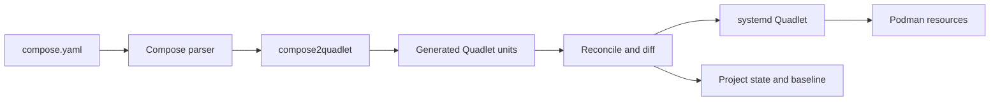

# Architecture

comquad turns a Compose project into systemd-managed Podman services. It does not supervise containers itself. It generates Quadlet files, asks systemd to reload them, and uses systemd and Podman for the runtime operations.

## System Overview



The main path is:

1. Read and validate `compose.yaml`.
2. Convert Compose objects into Quadlet units.
3. Compare the generated units with the deployed project.
4. Show a diff and ask for confirmation when changes are found.
5. Write the units, reload systemd, and start or restart affected resources.
6. Record the deployment state and generated baseline.

## Repository Structure

```text
cmd/comquad/           CLI commands and entry point
compose2quadlet/       Compose-to-Quadlet conversion library
internal/orchestrator/ Deployment pipeline and command behavior
internal/reconcile/    Diffing, merging, and atomic application
internal/deploy/       systemd D-Bus, Podman, paths, and project state
internal/logger/       Output levels and color handling
internal/output/       JSON output formatting and API schemas
tests/integration/     End-to-end tests using Podman and systemd
```

The orchestrator coordinates the other packages. The conversion library produces units; the reconcile package decides what should change; the deploy package applies those changes through systemd and Podman. The output package provides machine-readable JSON output for automation and integration.

## `up` Lifecycle

`comquad up` is the primary operation. Its pipeline has four stages:

### 1. Read and Transpile

`compose2quadlet.TranspileFile()` loads the Compose file through compose-go/v2 and produces structured Quadlet units. It handles services, networks, volumes, secrets, images, and build blocks, then serializes them as Quadlet INI files.

The conversion also applies comquad-specific behavior, including:

- Project-prefixed resource names and references
- Container names and service network aliases
- A default network when a service has no explicit network
- Absolute paths for relative bind mounts
- SELinux mount relabeling: `:Z` (private) for single-service volumes, `:z` (shared) for volumes used by multiple services
- Rootless port offsets
- Image and build unit generation
- Image name normalization (bare names → `docker.io/library/`), skippable via `COMQUAD_SKIP_REGISTRY_NORMALIZATION`
- Optional systemd specifier shortening (`%h` for `$HOME` paths), enabled via `COMQUAD_SYSTEMD_SPECIFIERS`
- comquad management and project labels

The conversion library is documented separately in [compose2quadlet/ARCHITECTURE.md](./compose2quadlet/ARCHITECTURE.md) and [compose2quadlet/doc/mapping.md](./compose2quadlet/doc/mapping.md).

### 2. Compute a Change Plan

`internal/reconcile` compares the new generated units with the files currently deployed. The result is a read-only plan containing per-file changes, removals, and merge conflicts.

On an existing deployment, comquad uses three inputs:

- **Baseline:** the units generated by the previous successful `up`
- **Disk:** the files currently in the systemd Quadlet directory
- **New:** the units generated from the current `compose.yaml`

This allows comquad to distinguish Compose changes from manual edits made with `comquad edit`:

```text
baseline + manual edits + new Compose output
                  |
                  v
             merged units
```

Conflicting edits are reported and the manual value wins. On a first deployment, or after `regenerate`, no baseline is available, so comquad falls back to a two-way comparison and warns that manual changes cannot be identified.

### 3. Show and Apply Changes

Unless `--no-diff` is used, `up` displays the plan before applying it. New files are shown in full, changed files as unified diffs, and removed files as removal diffs.

`--dry-run` computes and displays the plan without writing files, updating state, pulling images, reloading systemd, or starting units.

Applying a plan:

1. Writes generated Quadlet files atomically.
2. Removes files for services no longer in the Compose file.
3. Updates the baseline.
4. Stops removed units and reloads the systemd manager.
5. Starts `.image` units via systemd to pull images (respecting `Policy=` directive).
6. Starts `.build` units via systemd to build images.
7. Starts `.container` units and restarts changed containers.
8. Registers the project in the state file.

Only affected units are restarted. If a later step fails, files and baselines touched by the deployment are restored where possible.

Image pulling is delegated to systemd via `.image` quadlet units. The `--pull` flag value (`always`/`missing`/`never`) is applied as `Policy=` on `.image` units, allowing quadlet to enforce the pull behavior natively (requires podman >= 5.6). On older podman versions, the `Policy=` directive is ignored and images are always pulled.

### 4. Follow Logs

`comquad up -f` performs the deployment first, then follows journal output for the project units. The log start time is captured before units are started so startup logs are included.

## Reconciliation and State

comquad keeps two kinds of local state:

- `projects.json` records deployed projects, source paths, generated files, and managed resources.
- `baseline/<project>/` stores the pure generated output from the last successful deployment.

The baseline is deliberately separate from the files on disk. This is what makes it possible to preserve manual changes while still applying changes from `compose.yaml`.

State is stored below `$XDG_DATA_HOME/comquad/`, defaulting to `~/.local/share/comquad/`. The state file is written through a temporary file and rename so an interrupted write does not leave a partial JSON file.

`comquad regenerate --force` rebuilds project state from managed Podman labels and Quadlet files. Because it cannot reconstruct the previous generated baseline, the next `up` uses the two-way comparison described above.

## Generated Resources

Depending on the Compose file, comquad can generate:

| Compose resource | Quadlet resource |
|---|---|
| Service | `.container` |
| Image reference | `.image` |
| Build block | `.build` |
| Network | `.network` |
| Named volume | `.volume` |
| Secret | Native secret directives or secret mounts |

Container units reference their companion image or build units. This lets Quadlet and systemd express dependencies between pulling or building an image and starting its container.

External networks and volumes are not generated or removed by comquad. They remain references to the externally managed Podman resources.

Generated files are placed in the systemd Quadlet directory for the current execution context:

- Rootless: `~/.config/containers/systemd`
- Root: `/etc/containers/systemd`

## Runtime Commands

Commands such as `start`, `stop`, and `restart` operate on already-generated units through systemd D-Bus. They do not regenerate files or run reconciliation.

Commands that inspect or interact with services use the project state to resolve Compose service names to Quadlet files:

- `ps` combines Podman container information with systemd unit state.
- `logs` reads journald output and combines logs from multiple units chronologically.
- `exec` runs `podman exec` against the resolved container.
- `view` reads generated units and can show a project resource overview.
- `edit` opens generated units in `$EDITOR`, then reloads systemd when files change.

`down` stops the project's units, removes generated files and managed networks, unregisters the project, and removes auxiliary state. Named volumes are retained unless `--delete-volumes` is supplied.

## JSON Output

All commands support the `--json` global flag for machine-readable output. This enables automation, scripting, and integration with tools like Cockpit.

The output package (`internal/output`) provides:

- Versioned API envelope: `{"version": "1.0", "data": {...}}`
- Error envelope: `{"version": "1.0", "error": {"code": "...", "message": "..."}}`
- Schema definitions for each command's output structure

Commands check `output.IsJSONMode()` and emit JSON instead of human-readable tables or text. Supported commands:

| Command | Schema | Description |
|---|---|---|
| `list` | `ProjectListData` | List all deployed projects |
| `ps` | `PSData` | List containers for a project |
| `view` | `ViewData` or `UnitFileJSON` | Project overview or single unit file |
| `start` | `LifecycleData` | Start action result |
| `stop` | `LifecycleData` | Stop action result |
| `restart` | `LifecycleData` | Restart action result |
| `down` | `DownData` | Removal summary |
| `up` | `UpData` | Deployment summary |
| `logs` | `LogsData` | Structured log entries (batch mode) |

When adding JSON support to a new command:

1. Define the output schema in `internal/output/schemas.go`
2. Check `output.IsJSONMode()` in the command or orchestrator method
3. Convert internal data structures to JSON schema types
4. Call `output.PrintJSON()` with the schema-wrapped data

In JSON mode, operational messages (logger output) are suppressed to keep stdout clean for JSON parsing. Only the final JSON result is emitted.

## Cockpit Plugin

The `cockpit-comquad/` directory contains a Cockpit web UI plugin for managing comquad projects. The plugin communicates with comquad via `cockpit.spawn()` calls to the CLI with `--json` flag. It does not require a separate backend daemon.

The plugin provides:

- Stack dashboard with project status and service counts
- Project detail view with services, containers, and resources tabs
- Stack deployment via directory browser with change preview (dry-run)
- Lifecycle management (start/stop/restart/remove) with confirmation dialogs
- Update diff preview showing file changes before applying
- Resource unit file viewer (click resource names to view quadlet content)
- Clickable port links with per-port http/https toggle
- Internationalization (i18n) support using cockpit's gettext system

The plugin uses `comquad up --dry-run --json` for preview functionality, which returns structured diff data including file changes, image pull plans, and build plans.

### Testing

The cockpit plugin has a two-tier testing architecture:

**Tier 1: Unit Tests (vitest + React Testing Library)**
- 60 tests across 7 test files covering all components
- Mocked cockpit API for isolated testing
- Run with `npm test` in `cockpit-comquad/`

**Tier 2: Browser Integration Tests (Selenium + Chromium)**
- Container-based testing environment extending `comquad-test:latest`
- Python test suite with Selenium WebDriver
- Tests cover stack dashboard, project detail view, navigation, and action buttons
- Run with `make integration-cockpit` from the repository root

See [cockpit-comquad/TESTING.md](./cockpit-comquad/TESTING.md) for detailed testing documentation.

### Internationalization

The plugin supports internationalization using cockpit's gettext system:

- All user-facing strings wrapped with `_()` function
- Translation template in `cockpit-comquad/po/comquad.pot`
- Build system compiles `.po` files to JavaScript in `dist/po.<lang>.js`
- Language auto-detection via `po.js` loader based on browser language
- 20 core cockpit languages supported (ar, cs, de, es, fi, fr, id, it, ja, ka, ko, lo, pl, pt_BR, ro, ru, sv, tr, uk, zh_CN)
- Add new translations by copying `.pot` to `.po` and translating

See [cockpit-comquad/README.md](./cockpit-comquad/README.md) for translation workflow.

See [cockpit-comquad/README.md](./cockpit-comquad/README.md) for development and usage details.

## Failure Boundaries

comquad treats generated files, state, and systemd operations as separate steps:

- Transpilation errors stop before deployment.
- Dry runs do not perform writes or runtime changes.
- Reconciliation plans are computed before files are modified.
- File and baseline writes are atomic and have rollback handling.
- A failed service operation is reported rather than hidden by the CLI.

The systemd manager remains the source of truth for whether a unit is running. Podman remains the source of truth for container and resource details.

## Further Reading

- [README.md](./README.md) for installation and command usage
- [DEVELOPMENT.md](./DEVELOPMENT.md) for package details, command internals, and testing
- [compose2quadlet/ARCHITECTURE.md](./compose2quadlet/ARCHITECTURE.md) for the conversion library
- [compose2quadlet/doc/mapping.md](./compose2quadlet/doc/mapping.md) for Compose field mappings
